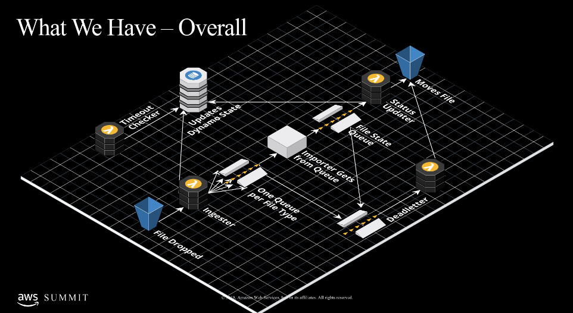

# sftp-automation-talk
As a conference speaker in the Start-up Booth at AWS Summit Toronto 2019 I presented my SFTP Automation design that solves the problem of manual easing work on existing SFTP Virtual Machine instances. It achieves this through leveraging many tools such as Transfer for AWS, Lambdas, DynamoDB, and SQS functionality.

While at Tulip I designed an SFTP automation framework to help ease the operations teams manual work on creating a new SFTP server for each of our new cusomters. This new solution - that you can see below - provided a full automated SFTP service that customers would get an automatically created user and SSH keys for authentication and they could immediately start dropping files on our newly hosted Transfer for SFTP service immediately after customer creation. 

This system was build through use of lambdas to do the file processing and organizing in the S3 Backend of the Transfer for SFTP service to manage which files are currently being processed, which files have failed and completed. Through use of SQS functionality we built a service that our imports could consume from to know which files to run next. Once a file started to be processed it could send an update to the file state queue for the automation to notify other aspects of the framework that a file was started and for no other jobs to start consuming it. 

We would consistently have status updates from the importers to keep our users and system updated of the status of a given file, eventually leading to a completed or failed state.

In the backend the status of all these files that need to be processed across all customers were being stored in a DynamoDB table. This table would hold information for all files that had been processed or were waiting to be processed by the system, and there would be regular checks across the system to verify the state of any given file at any given time.

As a safe guard, two functions were also added to this framework.\
Timeout Checker - This function would constantly be polling the dynamoDB table for any files that have timed out, the default for this was 7 days after it was dropped if no functions picked it up, and 1 day after a file is started it should be finished. This allowed us to maintain strict enforcement on our importers to run quick and efficiently.

Deadletter - The deadletter lambda was designed to prevent any potential issues in either our importers sending updates, or or lambdas getting stuck in a nasty, potentially breaking, loop.

